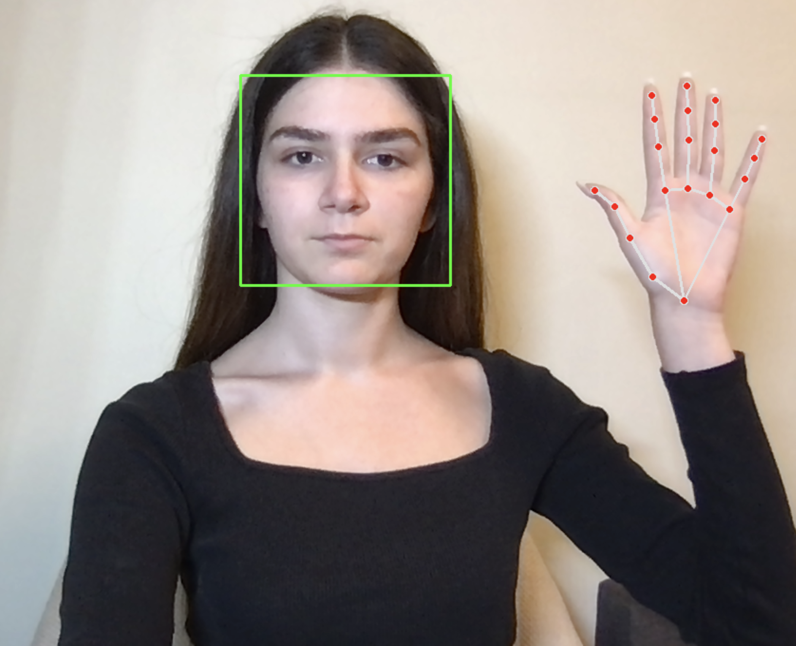

# Contactless Blood Pressure Estimation

## Introduction

Blood pressure is one of the most important physiological indicators for monitoring cardiovascular health and diagnosing conditions such as hypertension and cardiovascular diseases. Conventional blood pressure measurement relies on cuff-based devices, which require direct physical contact with the user and are not suitable for continuous or remote monitoring.

This project presents a **contactless blood pressure estimation system** using a standard webcam and **remote Photoplethysmography (rPPG)**. The application simultaneously extracts physiological signals from the user's **face** and **hand**, estimates the **Pulse Transit Time (PTT)** between the two regions, and computes **Systolic Blood Pressure (SBP)** and **Diastolic Blood Pressure (DBP)** using a hemodynamic model.

The project was developed as part of my internship and demonstrates a proof-of-concept implementation of a non-invasive and low-cost blood pressure estimation system.

---

## Measurement Setup

For a successful measurement, both the user's face and one hand must remain visible inside the camera frame throughout the recording session.

<p align="center">
    
</p>

**Figure 1.** Correct positioning of the user during the measurement process.

The application continuously tracks both regions and extracts the corresponding physiological signals used for Pulse Transit Time estimation.

---

## Methodology

The entire blood pressure estimation pipeline is implemented in a single script (`camera4.py`). The application performs the following processing stages:

### Face and Hand Detection

The system detects the user's face using the **OpenCV Haar Cascade Classifier** and detects the hand using **Google MediaPipe Hands**. These algorithms continuously track both regions throughout the measurement session and update their positions in every video frame.

### Region of Interest (ROI) Extraction

After detecting the face and hand, the application extracts the corresponding **Regions of Interest (ROIs)**.

For each video frame, the average **Red**, **Green**, and **Blue (RGB)** intensity values are calculated from both ROIs and stored in temporal buffers. These RGB sequences represent the raw physiological signals used for further processing.

If either the face or the hand is lost for several consecutive frames, the corresponding buffers are automatically cleared to avoid processing corrupted signals.

### Signal Preprocessing

The raw RGB signals are processed using the **Plane-Orthogonal-to-Skin (POS)** algorithm, which converts the temporal RGB values into remote photoplethysmography (rPPG) signals while reducing motion artifacts and illumination variations.

The extracted rPPG signals are then filtered using a **Butterworth band-pass filter** between **0.7 Hz** and **3.0 Hz**, corresponding to the physiological heart-rate range.

### Pulse Transit Time Estimation

After preprocessing, pulse peaks are detected independently from the facial and hand rPPG signals.

The application estimates the **Pulse Transit Time (PTT)** by measuring the delay between the detected pulse peaks of the face and the hand. The median delay is used as the final PTT estimate for each computation window.

### Blood Pressure Estimation

The estimated Pulse Transit Time is converted into **Systolic Blood Pressure (SBP)** and **Diastolic Blood Pressure (DBP)** using a vascular model that incorporates subject-specific parameters, including:

- Age
- Height
- Body Mass Index (BMI)

During the first seconds of every measurement session, the application automatically estimates a **reference PTT** that serves as an individual calibration baseline. This automatic calibration removes the need for manual subject-specific parameter adjustment before each measurement.

### Measurement Session

The application operates through a simple measurement workflow:

- The webcam continuously monitors the user's face and hand.
- Press **S** to start a **30-second** measurement session.
- During the session, blood pressure is estimated periodically.
- At the end of the recording, all estimated values are automatically exported to a timestamped CSV file.
- The application then returns to the idle state, ready for a new measurement.

---

## Running the Application

Clone or download the repository and ensure that all required Python packages are installed.

### Required Libraries

- OpenCV
- MediaPipe
- NumPy
- Pandas
- SciPy

### Windows

Run the application using:

```bash
python code.py
```

### Linux / macOS

Run the application using:

```bash
python3 code.py
```

---

## Measurement Procedure

1. Launch the application.
2. Position your face and one hand inside the camera frame (see Figure 1).
3. Ensure both regions remain visible throughout the recording.
4. Press **S** to begin a 30-second measurement session.
5. Remain as still as possible during the measurement.
6. After the session is completed, the estimated blood pressure values are displayed and automatically saved to a CSV file.
7. Press **S** again to start a new measurement or **Q** to exit the application.

---

## Output

Each completed measurement generates a timestamped CSV file containing:

- Timestamp
- Estimated Systolic Blood Pressure (SBP)
- Estimated Diastolic Blood Pressure (DBP)
- Pulse Transit Time (PTT)
- Frames Per Second (FPS)
- Reference PTT used during estimation

The generated CSV file can be used for further analysis or visualization of the estimated physiological parameters.
